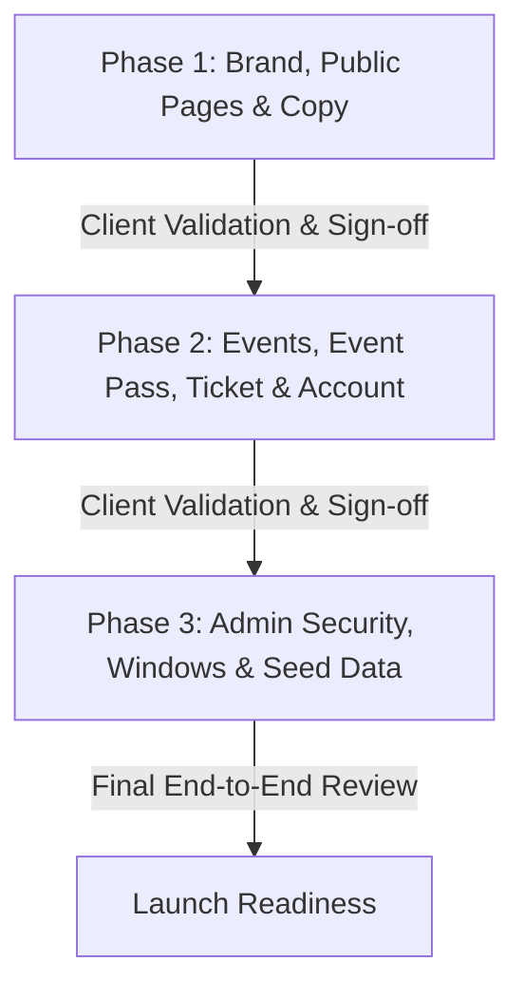

# The Mothers — Full Implementation Plan & Gap Analysis

**Date:** 25 August 2026  
**Reference Package:** `new FINAL VERSION _ Next JS _ Themothers.cc (9)`  
**Current Staging Target:** `mothers-zeta.vercel.app`

---

## 1. Executive Summary & Audit Assessment

Based on the newly supplied package (`Build Review - Staging.dc.html`, `Start Here.dc.html`, `Mobile Reference.dc.html`, `Developer Brief.dc.html`, `Backend Brief.dc.html`, and `Admin and CMS Brief.dc.html`), the staging build currently scores **63% overall fidelity** against the approved designs.

### Core Problems Identified in Audit:
1. **Rule Conflicts & Document Misalignments:** Discrepancies between earlier briefs and approved prototypes (e.g. tier structures, quarterly pricing, joining fees, cancellation copy).
2. **Launch Blockers:**
   - Public exposure of `/admin` routes and cron execution triggers without server-side middleware enforcement.
   - Missing master switch: **Membership Windows** management in admin.
   - Completely missing **Event Pass & Guest Ticket flow** (€35 pass, signed token ticket page at `/ticket/[token]`, 2 per person lifetime limit).
   - Event threshold auto-decisions hardcoded to T-7 rather than per-event `decision_at`.
   - Empty staging environment (all metrics read 0 / €0, preventing client operational verification).
3. **Information Architecture Clutter:**
   - 7-item header navigation instead of the approved minimal 3-item header (`Membership` · `Events` · `Login`).
   - `Godmothers` exposed as a public pitch page (`/ambassadors`) rather than an internal member account tab.
   - Leftover shop/boutique references in code and database schemas.
4. **Mobile & UX Deficiencies:**
   - Mobile nav drawer and swipeable filters for Events/Account tabs not adhering to `Mobile Reference.dc.html`.
   - FAQ containing only 5 items instead of the 13 verbatim bilingual entries.
   - Client-side data fetching for Events causing flashes and bad link previews.

---

## 2. Agreed Rule Register (§3a Reconciliation)

All conflicts between past briefs and approved prototypes have now been reconciled and must be strictly enforced:

| Rule / Field | Established Specification | Implementation Rule |
| :--- | :--- | :--- |
| **Joining Fee** | €19 charged on first invoice | **Standard:** €19 + €39 = €58 1st month (€23 with recent pass). **Opening:** €19 + €29 = €48 1st month (€13 with recent pass). Pass discount applies to 1st invoice only. |
| **Membership Tiers** | 3 Tier Cards | 1. **Opening Circle (€29/mo or €79/quarter):** First 50 spots, locked 12 months. 2. **The Circle (€39/mo or €99/quarter):** Locked until 50 spots fill. 3. **The Inner Circle (Phase 2):** Teaser card without price. |
| **Quarterly Credit Rule (§20.2)** | 20 credits per month | Quarterly payers get 20 credits on payment date, then 20 credits at each subsequent month boundary (not 60 credits upfront). |
| **Pause Allowance (§20.1a)** | Up to 2 months / calendar year | Free pause in whole-month increments. Credit expiry clock freezes; booking blocked during pause; reset every Jan 1. Copy: *"Pause for up to two months a year at no cost. No cancellation fees, ever."* |
| **Booking Cancellation** | 24-hour cutoff + second clause | Free up to 24h prior to event. Inside 24h: credit returns only if another member/guest takes the spot. |
| **Event Pass Scope** | €35 single pass | Max 2 per person ever. Available T-14 to T-2 on confirmed non-signature events $\le 18$ credits. €35 credited back if joining within 30 days. |
| **Extra Credits** | €1 / credit | Buyable anytime by active members, 6-month expiry, no rollover cap. |
| **Credit Expiry** | 6-Month FIFO | Clock pauses during membership pause. |
| **Godmother Referral** | 5 + 15 credits | +5 credits on referral join, +15 credits on referral renewal. |
| **No-Shows** | 2 in 3 months | Automatically pauses RSVP capabilities until member contacts club. |
| **Stage Chips** | Informational tags | *Pregnant*, *Babies*, *Toddlers*, *Children*, *Big kids*, or *Open to every stage*. Never blocks booking. |

---

## 3. Phased Implementation Plan

Following the client's voice note strategy, work is divided into 3 distinct validation phases:

---

### Phase 1: Brand, Public Architecture & Polish
*Target: Home, Membership, Journal, Partners, FAQ, Mobile Header & Footer*

#### 1.1 Navigation & Global Layout
- Update [src/components/Navigation.tsx](file:///d:/downloads%206-11-2025/Mothers/src/components/Navigation.tsx):
  - Reduce header links to 3 items: `Membership`, `Events`, `Login / Members Area`.
  - Use high-resolution SVGs (`logo-mark-alpha.svg`, `logo-wordmark-alpha.svg`).
  - Implement mobile hamburger menu drawer with smooth backdrop blur, min 44px tap targets.
- Update [src/components/Footer.tsx](file:///d:/downloads%206-11-2025/Mothers/src/components/Footer.tsx):
  - Add `Journal`, `Partners`, `FAQ`, `Privacy Policy`, `Terms & Conditions`, and `Legal`.
  - Remove any legacy shop/boutique links.
- Redirect `/ambassadors` route to `/membership` (Godmothers is now an internal member tab).

#### 1.2 Home Page (`/`)
- Align copy verbatim in EN and ES with `Home.dc.html`.
- Implement the two soft-entry modules:
  - **The €35 Event Pass** ("Try us before you join").
  - **The Letter** (newsletter/intake waitlist).
- Hook the live spots counter into the dynamic active Membership Window.

#### 1.3 Membership Page (`/membership` & `/membership/apply`)
- Render the approved 3-tier card layout:
  - **Opening Circle:** €29/mo or €79/quarter (first 50 members).
  - **The Circle:** €39/mo or €99/quarter (locked badge: "Opens after the Opening Window").
  - **Inner Circle (Phase 2):** Informational teaser card.
- Update joining fee display: clarify €58 / €48 first invoice, €23 / €13 with pass credit.
- Add **Closed Window State**: When intake window is closed, display waitlist signup and Letter prompt.
- Refactor `/membership/apply` wizard: Group 11 steps into logical, smooth mobile screens with `localStorage` persistence.

#### 1.4 FAQ Page (`/faq`)
- Replace the 5 generic FAQs with all **13 approved Q&As verbatim** (EN & ES) covering credits, pause rules, Godmother rewards, cancellation 24h clause, childcare badges, vetting, and window transitions.

#### 1.5 Journal & Partners
- **Partners (`/partners`):** Display all 5 umbrella categories even when empty; enforce 1-partner-per-specialty exclusivity.
- **Journal (`/journal`):** Ensure ragged-right mobile typography and individual OpenGraph meta tags per post.

---

### Phase 2: Calendar Engine, Event Pass & Member Account
*Target: Events, Guest Checkout, Ticket View, Account Tabs & Godmother*

#### 2.1 Events Calendar (`/events`)
- Convert calendar to **Server-Side Rendering (SSR)** for instant mobile paint and SEO previews.
- Add horizontal swipeable chip filter rows on mobile: Category, Stage (*Pregnant*, *Babies*, *Toddlers*, etc.), and Month.
- Style event cards according to strict status color palette:
  - Confirmed: `#e8f1e9`
  - Pending: `#fff3e4`
  - Cancelled: `#fbf1f1`
  - Past: `#e9eaea`
  - Page canvas: `#FEFDF9`
- Add guest purchase CTA ("€35 Event Pass") on eligible events (confirmed, non-signature, $\le 18$ credits, T-14 to T-2).

#### 2.2 Event Pass & Ticket System
- **Guest Checkout Flow:** Stripe checkout for €35 guest pass without mandatory account password creation. Enforce 2 passes per email limit server-side.
- **Ticket Page (`/ticket/[token]`):**
  - Authenticated via secure, hashed signed token (valid up to 48h post-event).
  - Mobile-first layout: date, venue/meeting point (revealed only once confirmed), and "Release Place" CTA.

#### 2.3 Member Account (`/account`)
- Implement 6 tabs in horizontal swipeable bar:
  1. **Overview:** Upcoming bookings, active tier badge, live credit balance.
  2. **Credits:** Full FIFO transaction history, expiry dates, and frozen status indicator during pause.
  3. **Groups:** Stage & neighbourhood circles.
  4. **Godmother:** Referral link generation, invite tracker, +5/+15 credit payout tracker.
  5. **Membership:** Tier details, pause management (up to 2 months/year), payment method update.
  6. **Details:** Contact info and children birth month/year (no full names).
- Add "Buy Extra Credits" modal (€1/credit, 6-month expiry).

---

### Phase 3: Admin Master Controls, Security & Staging Seeding
*Target: Route Protection, Windows Manager, Attendance, Audit & Test Data*

#### 3.1 Security & Access Control (Critical Blocker)
- Create [src/middleware.ts](file:///d:/downloads%206-11-2025/Mothers/src/middleware.ts) enforcing server-side session checks on `/admin/*`.
- Protect API cron routes with `x-cron-secret` authorization headers.
- Remove legacy shop endpoints and physical store mirrors.

#### 3.2 Membership Windows Back Office
- Build Admin Window Management interface (`/admin/settings` / `/admin/windows`):
  - Create window, set total quota (e.g. 50), set tier prices (€29/€39, €79/€99), open window, close window early.
  - Automatically controls public application availability and spots countdown.

#### 3.3 Event Threshold Auto-Decisions & Attendance
- Refactor cron scheduler to evaluate each event based on its specific `decision_at` datetime rather than a fixed T-7.
- Implement mobile-ready Attendance Check-in sheet in Admin for walk hosts.

#### 3.4 Staging Database Seeding
- Update [src/db/seed.ts](file:///d:/downloads%206-11-2025/Mothers/src/db/seed.ts) to populate realistic staging data:
  - 1 Active Membership Window (e.g. 42/50 spots remaining).
  - 3 Test Members with active credits and ledger entries.
  - 4 Events (1 Confirmed with guest pass enabled, 1 Pending threshold mid-fill, 1 Free walk, 1 Past).
  - 2 Applicant submissions in review queue.
  - 13 FAQs and 5 Partner umbrellas.

---

## 4. Verification & Testing Matrix

| Component | Verification Method |
| :--- | :--- |
| **Admin Route Security** | Attempt accessing `/admin` in unauthenticated incognito mode; verify strict redirect to `/account/login`. |
| **Cron Trigger Security** | Make HTTP POST to cron routes without secret header; verify 401 Unauthorized. |
| **Mobile Drawer & Touch** | Test on iPhone 16 viewport (393px width): ensure smooth drawer animation, swipeable tabs, and no auto-zoom on form focus. |
| **Membership Window Toggle** | Toggle window open/closed in admin; verify `/membership` and `/` instantly switch between live application counter and waitlist/Letter state. |
| **Event Pass & Ticket** | Purchase €35 guest ticket; verify receipt token link loads `/ticket/[token]` with correct meeting point and release logic. |
| **13 FAQs Translation** | Verify language toggle switches all 13 accordion questions and answers between English and Spanish seamlessly. |

---

*Plan created on 25 August 2026.*
