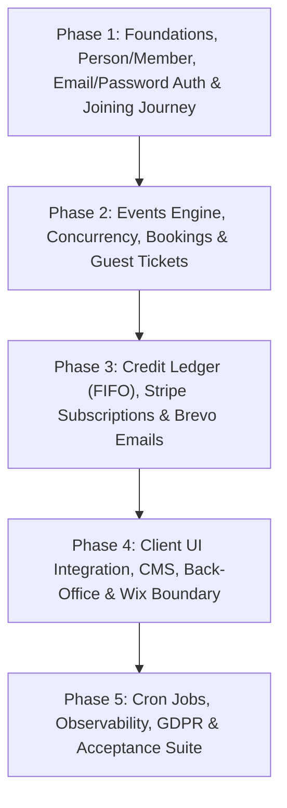

# Architecture & Implementation Plan — The Mothers

> **Platform Stack & Architecture Strategy**  
> Based on [projectDetails.md](file:///d:/downloads%206-11-2025/Mothers/projectDetails.md) and latest verified design source:  
> `FINAL VERSION _ Next JS _ Themothers.cc (3)/uploads/FINAL VERSION_ The mothers.cc (5)`

---

## 1. Confirmed Architecture & Tech Decisions

### 1.1 ORM & Database: **Drizzle ORM + Supabase PostgreSQL**
- **Database**: Supabase PostgreSQL 15+.
- **ORM**: Drizzle ORM for full type-safety, zero-overhead cold starts, and native support for PostgreSQL row-level locks (`SELECT ... FOR UPDATE` via `.for('update')`) required for concurrent booking transactions (§7.1, §7.5).
- **Constraints & Ledger**: Database-level partial unique indexes, check constraints, and append-only trigger protection on `credit_entry` and `audit_log`.

### 1.2 Authentication: **NextAuth.js (Auth.js v5) with Email & Password**
- **Member Authentication**: **Email & Password** using NextAuth Credentials Provider with secure password hashing (`argon2id` / `bcrypt`).
  - Eliminates mandatory magic-link emails for standard logins.
  - Password reset capability powered by Brevo using `Email - Password Reset.html`.
- **Admin Authentication**: Separate admin credentials table (`admin_user`) with role-based access control (`owner`, `manager`, `host`), MFA enforcement for owner/manager roles, and shorter session lifespans behind custom middleware (§12).
- **Session & Guarding**: Central pure function `hasMemberAccess(member, at)` used consistently across routes, RSCs, and Server Actions.

### 1.3 Media Storage: **Supabase Storage (S3-compatible)**
- S3-compatible Supabase Storage buckets for hero images, partner logos, and media assets.
- Automatic image resizing/re-encoding pipeline on upload, storing clean originals (§2).

### 1.4 Email Delivery: **Brevo (Sendinblue)**
- Brevo API / SMTP integration for tokenized HTML templates from `FINAL VERSION _ Next JS _ Themothers.cc (3)/Email - *.html`.
- Queue system in `email_log` with unique `dedupe_key` (`template + entity + date`) for strict send idempotency (§11).
- Clear segregation between **Transactional** (always delivered) and **Promotional** (honoring `marketing_opt_in` & 1-click unsubscribe).

### 1.5 Latest Verified Frontend Assets & Design Source
- Authoritative Design Assets: `uploads/FINAL VERSION_ The mothers.cc (5)`
  - `Home.dc.html`, `Membership.dc.html`, `Events.dc.html`, `Account.dc.html`
  - `Ambassadors.dc.html` (updated +20 credits Godmother referral rule, no free month)
  - `Activity Statement.dc.html`, `Partners.dc.html`, `Payment.dc.html`, `FAQ.dc.html`, `Journal.dc.html`, `Privacy.dc.html`, `Terms.dc.html`, `Prelaunch.dc.html`
  - `Membership Application - Questions.dc.html`
  - Bilingual EN/ES translations and `_ds` classical design system.

---

## 2. Phased Implementation Roadmap

---

## Phase 1: Foundations, Person Identity, Email/Password Auth & Joining Journey

### 1. Database & Schema Initialization (Supabase + Drizzle)
- Initialize Next.js App Router project with TypeScript, Drizzle ORM, and Supabase client.
- Create core identity & membership schema:
  - `person` (root identity, email lowercased & unique, `phone_e164`, `whatsapp_e164`, `is_mother`, `marketing_opt_in`, `locale` default 'es', `deleted_at`)
  - `credential` / `member_password` (`person_id`, `password_hash`, `password_updated_at`)
  - `member` (`person_id` unique, `status`, `stage`, `neighbourhood`, JSONB `children`, Stripe references, `at_risk_since`, `price_locked_until`)
  - `admin_user` (`role`: owner, manager, host, `password_hash`, `mfa_enrolled_at`, `disabled_at`)
  - `waitlist_entry` (one active entry per person)
  - `window` (partial unique index for single `open` status: `UNIQUE (status) WHERE status = 'open'`)
  - `application` & `application_form_version` (versioned question sets based on `Membership Application - Questions.dc.html`)
  - `audit_log` (immutable tracking of every status/balance change)
- Add Postgres migration scripts and database triggers (blocking updates/deletions on audit logs).

### 2. NextAuth (Auth.js v5) Email & Password Setup
- Setup NextAuth with Credentials provider:
  - Email + Password validation for members against hashed password in database.
  - Separate secure session for admin users with role validation.
- Password set / reset workflow using Brevo with `Email - Password Reset.html`.
- Shared pure access helper: `hasMemberAccess(member, at)` (§4.1, §10).

### 3. Joining & Application Journey
- **Joining Window System**:
  - Public display of active window status or fallback to general waitlist.
  - Form submission storing answers mapped to versioned `application_form_version`.
- **Application Decision Workflow**:
  - Admin review queue (Accept / Decline / Skip / Request notes).
  - Accepted status generates a signed 72-hour payment link (`accept_expires_at`).
  - Declined status routes to waitlist & newsletter subscription options.
- **Member Profile & History Foundation**:
  - Member account dashboard displaying personal details, children stage tags, active membership tier, password change option, and timeline.

---

## Phase 2: Events Management, Booking Engine & Guest Ticketing

### 1. Events Schema & Administration
- Tables: `event`, `event_category`, `booking`, `event_waitlist`, `event_change_log`.
- Admin Event CRUD: duplicate event in one click, manual credit pricing (no category inheritance), minimum-to-confirm threshold, and decision date (`decision_at`).
- Status lifecycle: `draft` → `published(pending)` → `confirmed` → `completed` / `cancelled`.

### 2. High-Concurrency Booking Engine (§7)
- Dual capacity pools: `capacity_member` and `capacity_guest`.
- Atomic booking transaction:
  1. `SELECT ... FOR UPDATE` on the event row via Drizzle.
  2. Validate member access, seat availability, and credit balance.
  3. Write booking snapshotting `credits_charged`.
  4. Post-commit email queue dispatch.
- Unique DB constraint: `(event_id, person_id)` where status is active (prevents double-booking).

### 3. Member & Guest Release / Waitlist Offers
- **Member Release**: Frees seat, returns credits, triggers automatic position-1 waitlist offer with 24h / 2h expiry.
- **Guest Ticketing Without Accounts (§9)**:
  - 32-byte cryptographic single-purpose token for guest ticket view, meeting point reveal, and release.
  - Rate-limited token endpoints without leaking personal email addresses.

### 4. Event Cancellation Transaction (§7.5)
- Atomic multi-step reversal: marks event cancelled, rolls back all member bookings with credit refund entries, triggers guest pass refunds, and enqueues attendee notifications.

---

## Phase 3: Credit Ledger, Stripe Subscriptions & Brevo Emails

### 1. Immutable Credit Ledger Engine (§5)
- Table: `credit_entry` (append-only; Postgres trigger blocking `UPDATE` or `DELETE`).
- Table: `credit_allocation` (links spend entries to grant entries for exact FIFO tracking).
- FIFO spend algorithm: Spends from oldest non-expired grant first.
- Returns algorithm: Reallocates returned credits to their original grant expiry (or next period end if expired).
- Cap handling: Monthly 20-credit grant auto-trimmed to 40 max (`min(20, 40 - balance)`). Godmother bonus credits sit outside the 40-credit rollover cap.

### 2. Stripe Webhook Integration (§6)
- Webhook route: `POST /api/webhooks/stripe` with raw signature validation and `stripe_event` idempotency.
- Handlers:
  - `checkout.session.completed`: Finalizes membership / guest pass purchase.
  - `invoice.paid`: Grants 20 credits (trimmed), extends `current_period_end`.
  - `invoice.payment_failed`: Marks `past_due`, maintains access through `current_period_end`.
  - `customer.subscription.updated/deleted`: Reconciles cancel/pause states.
- Event Pass 30-day conversion: Automatically credits €35 pass against €58 joining fee when joining within 30 days.

### 3. Brevo (Sendinblue) Email Worker (§11)
- Tokenize the 11 HTML email templates from the design folder (`Email - Booking Confirmed.html`, etc.).
- Queue system in `email_log` with unique `dedupe_key` (`template + entity + date`).
- Clear separation: Transactional (guaranteed send) vs Promotional (requires `marketing_opt_in` and 1-click unsubscribe).
- Webhook handler for Brevo delivery/bounce tracking.

---

## Phase 4: Frontend Component Integration, CMS & Wix Boundary

### 1. UI Integration from Latest Client Files (`uploads/FINAL VERSION_ The mothers.cc (5)`)
- Extract design tokens, fonts (`Cormorant Garamond`, `Lora`), and styling system from `uploads/FINAL VERSION_ The mothers.cc (5)/_ds`.
- Implement responsive pages with bilingual (EN/ES) support:
  - Public pages: `Home`, `Membership`, `Events`, `Ambassadors`, `Journal`, `FAQ`, `Partners`, `Legal/Privacy/Terms`.
  - Member Portal: `Account` (overview, login/password auth, stage/neighbourhood groups), `Activity Statement`, Bookings & Passes.
  - Admin Back-Office: Action-oriented dashboard (queue-first), Application review, Event manager, Member inspector.

### 2. CMS & Static Caching Strategy (§15)
- Server Actions for client editing of page copy, FAQ items, and partners with exclusivity checks (1 partner per specialty).
- Static page generation with On-Demand Tag Revalidation (`revalidateTag('events')`, `revalidateTag('journal')`).
- Live real-time seat counter bypasses edge cache for 100% accurate availability.

### 3. Wix Subdomain Integration (§14)
- **`POST /api/wix/verify-member`**: Signed server-to-server check answering `{ active: true/false }` for members-only shop pickup.
- **`POST /api/wix/order`**: Read-only order mirror storing order summary for the member's account view.

---

## Phase 5: Cron Jobs, Observability, GDPR & Acceptance Suite

### 1. Scheduled Background Jobs (Vercel Cron + `job_run` §8)
- `open_guest_windows` (T-14 / confirmation to T-2)
- `resolve_thresholds` (confirm/cancel at `decision_at`)
- `expire_credits` (nightly ledger debit for expired grants)
- `expire_offers` (waitlist & 72h application expiry)
- `flag_at_risk` (nightly check for 60 days inactivity)
- `reconcile` (nightly ledger balance vs cached view, Stripe status sync)

### 2. GDPR & Data Protection Tooling (§16)
- Explicit `consent_record` with verbatim text, timestamp, and IP.
- One-click user data export (JSON + PDF).
- Anonymization routine (replaces identifiers, preserves financial/attendance tombstone records).

### 3. Acceptance Test Suite (§18)
- 21 automated integration tests in Vitest/Jest covering:
  - Concurrent booking races
  - Idempotent Stripe webhooks
  - FIFO credit ledger calculations and capping
  - 30-day pass discount math
  - Status transition protections
