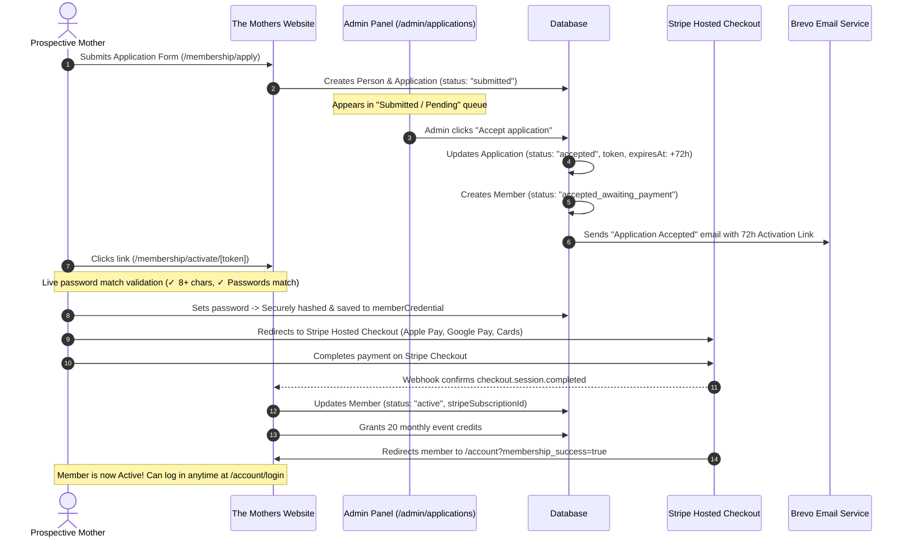

# Membership Lifecycle Inspection & Architecture Report

This report provides a clear, step-by-step breakdown of how a membership works in **The Mothers** platform—from submission, to admin acceptance, payment, login creation, and access rules upon cancellation.

---

## 1. Flow Diagram: End-to-End Membership Lifecycle



---

## 2. Detailed Step-by-Step Breakdown

### Step 1: Application Submission & "Pending" State
1. **User Action**: The prospective mother applies via `/membership/apply` by submitting her name, email, pregnancy/motherhood stage, neighborhood, and billing preference (monthly/quarterly).
2. **Database State**:
   - A `person` record is created or linked.
   - An `application` record is created with `status = "submitted"`.
3. **Admin Dashboard**:
   - The application immediately appears under the **"Submitted / Pending"** tab in `/admin/applications` ([src/app/admin/applications/page.tsx](file:///d:/downloads%206-11-2025/Mothers/src/app/admin/applications/page.tsx)).
   - Admins can view answers, stage, and neighborhood details.

---

### Step 2: Admin Acceptance & 72-Hour Payment Link
1. **Admin Action**: The admin clicks **"Accept application"** in `/admin/applications`.
2. **Backend Action** ([src/app/actions/admin.ts](file:///d:/downloads%206-11-2025/Mothers/src/app/actions/admin.ts) `acceptApplication`):
   - Generates a secure, cryptographic 72-hour `paymentLinkToken`.
   - Sets `application.status = "accepted"` and `application.acceptExpiresAt = now + 72 hours`.
   - Sets `member.status = "accepted_awaiting_payment"`.
   - Triggers the **"Email - Accepted"** (`application_accepted`) email via Brevo.
3. **Email Content**:
   - Warm welcome message explaining that their place is held for 72 hours.
   - Transparent price breakdown (including joining fee waiver rules if eligible).
   - Direct personal activation link:
     ```
     https://themothers.cc/membership/activate/[paymentLinkToken]
     ```

---

### Step 3: Member Payment & Login Credentials Creation
1. **Activation Page** (`/membership/activate/[token]`):
   - The user opens their unique activation link.
   - The page displays:
     - **Email**: Pre-filled and locked to the application email.
     - **Set Password**: Password + Confirm Password input (minimum 8 characters).
     - **Payment Form**: Integrated Stripe Card Element with billing address verification.
2. **Submitting Activation**:
   - **Password Saving**: `saveMemberPassword(token, password)` hashes the password using `bcrypt` (12 rounds) and saves it to the `memberCredential` table.
   - **Payment Execution**: Stripe confirms the payment intent / subscription.
3. **Automatic Activation via Webhook** ([src/app/api/stripe/webhook/route.ts](file:///d:/downloads%206-11-2025/Mothers/src/app/api/stripe/webhook/route.ts)):
   - Stripe sends `checkout.session.completed` / `payment_intent.succeeded`.
   - `member.status` transitions from `"accepted_awaiting_payment"` to **`"active"`**.
   - First month's **20 event credits** are granted to `creditEntry`.
   - `application.isPaid` is set to `true`.
   - Member is redirected to `/account?membership_success=true`.

---

### Step 4: How Members Log In & Manage Credentials
- **Login URL**: `/account/login`
- **Login Credentials**:
  - **Email**: The email used on their application.
  - **Password**: The password they set during the activation/payment step.
- **Forgot Password**:
  - If a member forgets their password, they click "Forgot password" on `/account/login`.
  - `/account/forgot-password` sends a secure password reset link to their email, updating their `memberCredential` upon reset.

---

### Step 5: What Happens if a Membership is Cancelled?

#### A. Cancellation Scenarios
1. **Self-Cancellation via Member Portal** (`/account` $\rightarrow$ `cancelMembership`):
   - Member clicks "Cancel membership".
   - Stripe subscription is updated with `cancel_at_period_end: true`.
   - DB flag `member.cancelAtPeriodEnd = true`.
2. **Subscription Expiration / Lapsed Status**:
   - When the current billing period concludes (or if payment fails repeatedly), Stripe sends `customer.subscription.deleted`.
   - Webhook sets `member.status = "lapsed"`.
3. **Admin Administrative Cancellation**:
   - Admin releases the application or marks the member inactive/banned.

#### B. Can they still log in after cancellation?
| Status | Can Log In to `/account`? | Can Book Member Events? | Available Credits |
| :--- | :--- | :--- | :--- |
| **Active (`active`)** |  **Yes** |  **Yes** (full access) | Full balance |
| **Cancelling at Period End (`cancel_at_period_end`)** |  **Yes** |  **Yes** (until `currentPeriodEnd`) | Usable until period end |
| **Lapsed / Cancelled (`lapsed`)** |  **Yes** (Portal Only) | ❌ **No** (`PERIOD_ENDED` / `INACTIVE_STATUS`) | Locked / inactive |
| **Paused (`paused`)** |  **Yes** | ❌ **No** (during pause) | Retained, resumes when unpaused |
| **Banned (`banned`)** | ❌ **No access** | ❌ **No** (`MEMBER_BANNED`) | Revoked |

**Summary of Post-Cancellation Behavior**:
- A member whose subscription has ended **can still log into their portal** to see their past receipts, transaction statements, and event history.
- However, **all member privileges are locked**: The access engine ([src/lib/access.ts](file:///d:/downloads%206-11-2025/Mothers/src/lib/access.ts) `hasMemberAccess`) automatically denies them from booking member events, claiming member perks, or using member credits.
- If they wish to rejoin, they can easily reactivate or reapply.

---

## 3. Key Findings & Assurance

1. **Security**: Passwords are never sent over unencrypted channels and are hashed with bcrypt.
2. **Graceful Expiration**: The 72-hour token strictly enforces expiration; if a link expires, the admin can click "Extend payment link (72h)" in the admin panel.
3. **Audit Trail**: Every action (submit, accept, pay, pause, cancel, remove) logs an immutable entry into `audit_log`.
